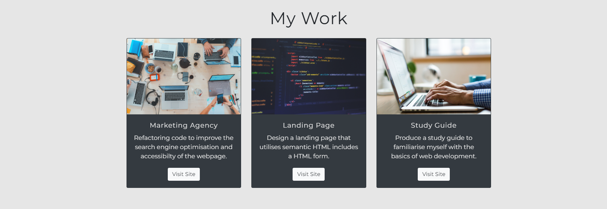
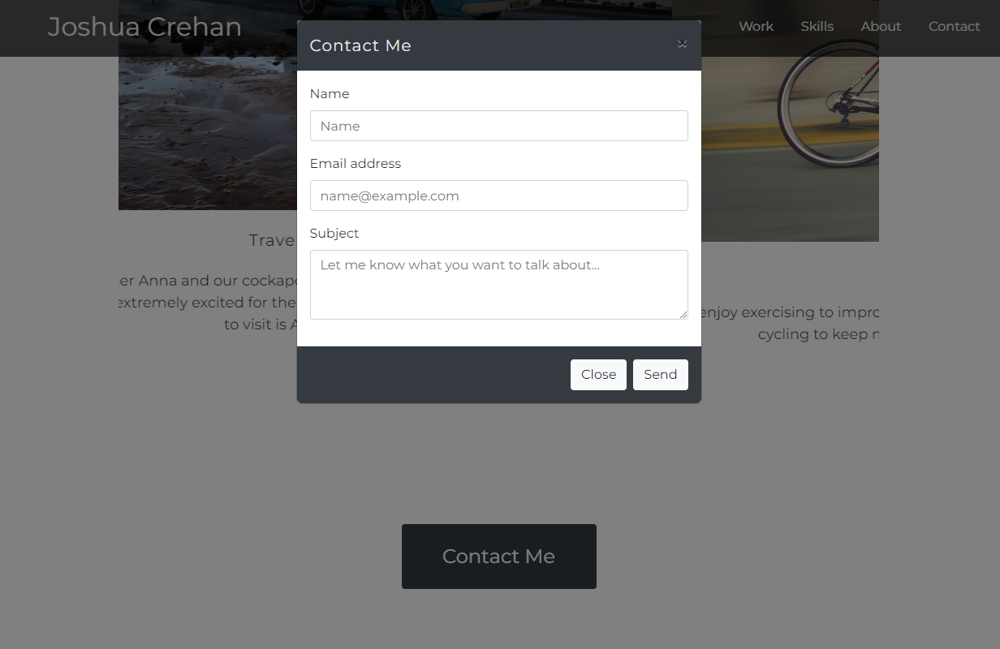
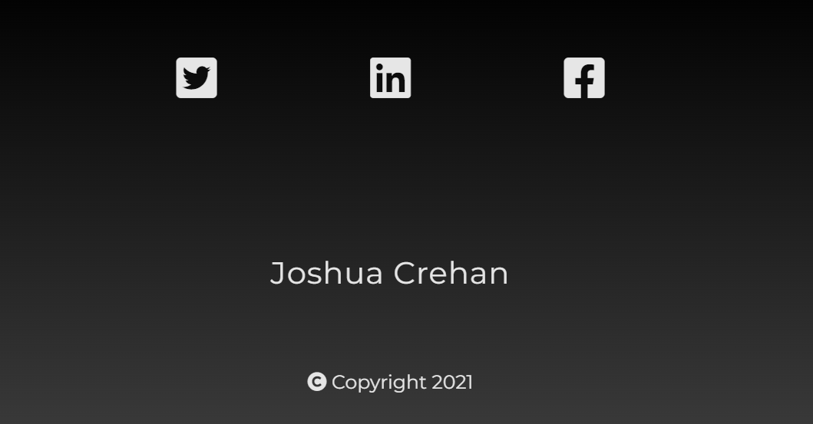

# Bootstrap-portfolio
Portfolio  designed in HTML/CSS utilising bootstrap 


## Description
This portfolio has been designed to introduce myself and is a place that I can display the work I have completed during the first month of my web development bootcamp.

For this challenge, it was a requirement to make use of bootstrap components that we have covered in class, such as the navbar, jumbotron and cards. I have also added a bootstrap carousel to my portfolio.

In the future I would like to add more JavaScript to my portfolio to get better functionality.


## Table of Contents
- [Installation](#Installation)
- [Usage](#Usage)
- [Credits](#Credits)
- [License](#License)


## Installation
N/A


## Usage
Use the navbar that is fixed to the top of the viewport to navigate through the different sections of the portfolio.

Clicking on the name in the navbar will take the viewer to the hero section at the top of the page.


Links in "My Work" section navigate to the relevant deployed page when clicked on.




Clicking on the "Contact Me" button will open a modal that the user can enter their name, email and a topic of conversation they would like to get in touch with. ```diff - Please note that the functionality of this form is not currently working. ```




There are social media icons in the footer that navigate to the relevant websites.




## Credits
N/A


## License
Please refer to the LICENSE in the repo.